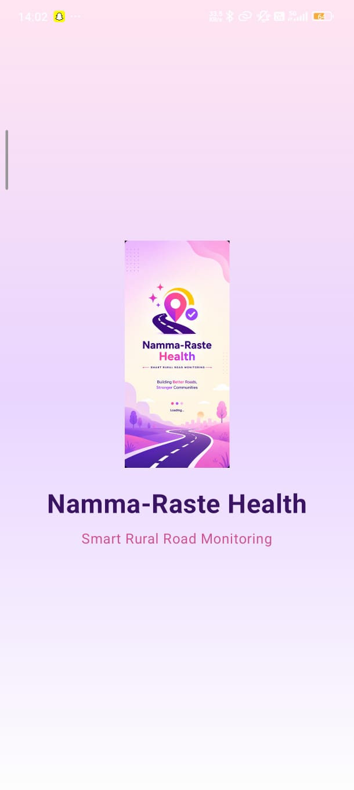
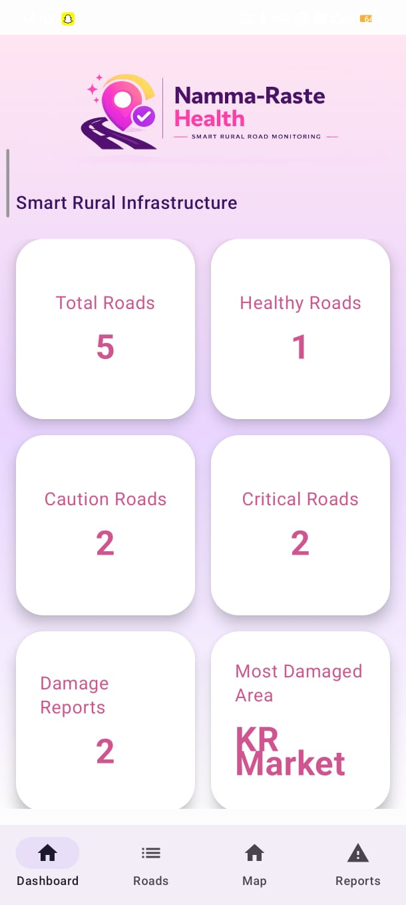
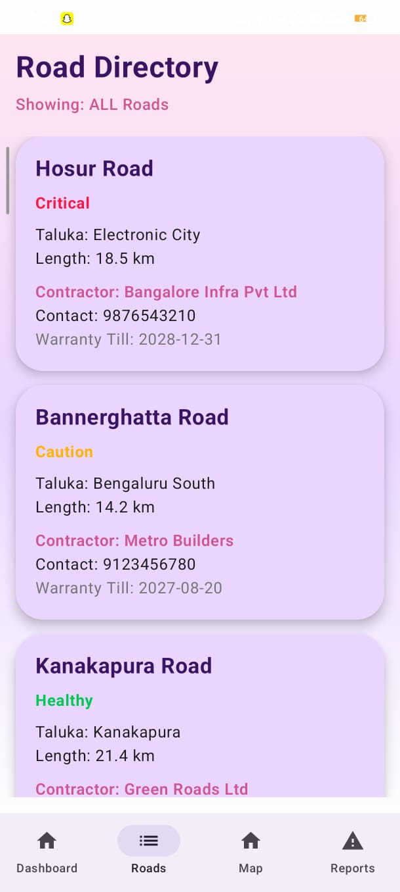
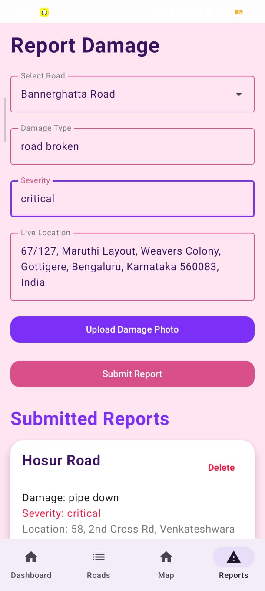
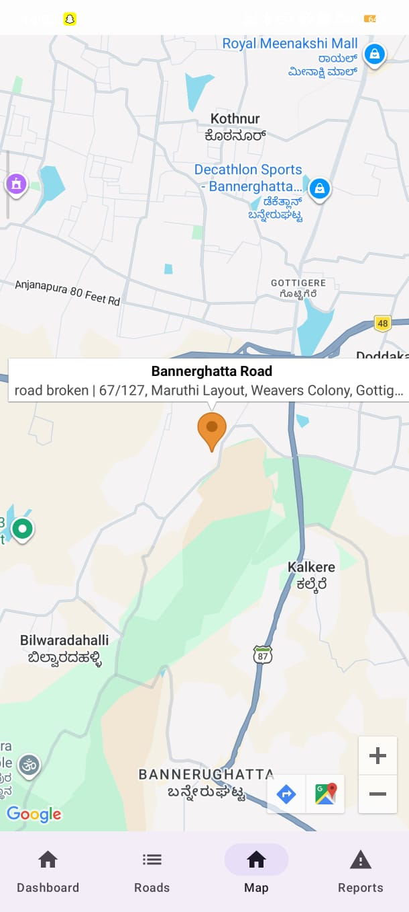
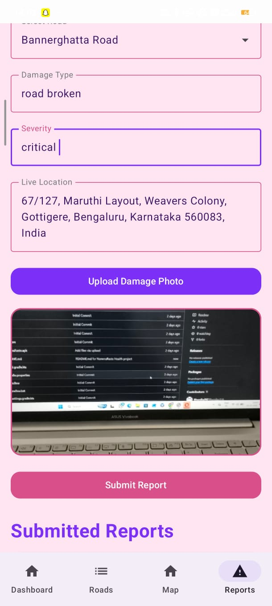
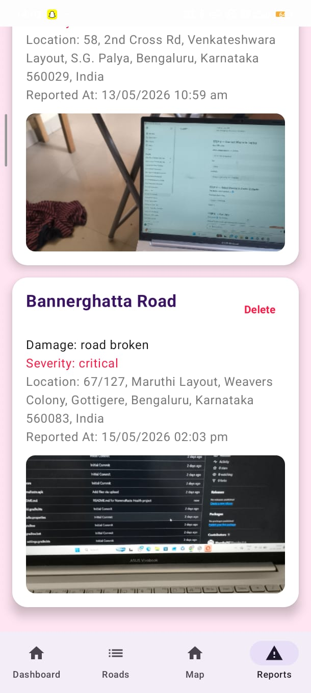

# NammaRaste Health

## Smart Rural Road Monitoring System

NammaRaste Health is an Android application developed to help users report rural road damages efficiently using live GPS location, image upload, and interactive map visualization.

The application allows authorities and users to monitor damaged roads, track critical areas, and improve rural road maintenance digitally.

---

## Features

- Dashboard with road statistics
- Road directory with health status
- Damage reporting system
- Live GPS location tracking
- Upload damage photos
- Camera and gallery image support
- Google Maps integration
- Damage severity tracking
- Splash screen and custom UI design
- Room Database integration

---

## Technologies Used

- Kotlin
- Jetpack Compose
- Room Database
- Google Maps API
- Android Studio
- Material 3

---

## Project Structure

- UI Screens
- ViewModels
- Repository Layer
- Room Database
- Google Maps Integration

---

## How to Run

1. Clone the repository
2. Open in Android Studio
3. Sync Gradle
4. Run on Emulator or Android Device

---
## Project Screenshots

### Splash Screen

### Dashboard Screen

### Road Directory

### Report Damage Screen

### Map Location Display

### Camera Capture Feature

### Submitted Reports

## APK

APK file is included in the repository for direct installation.

---

## Author

Bhumika
